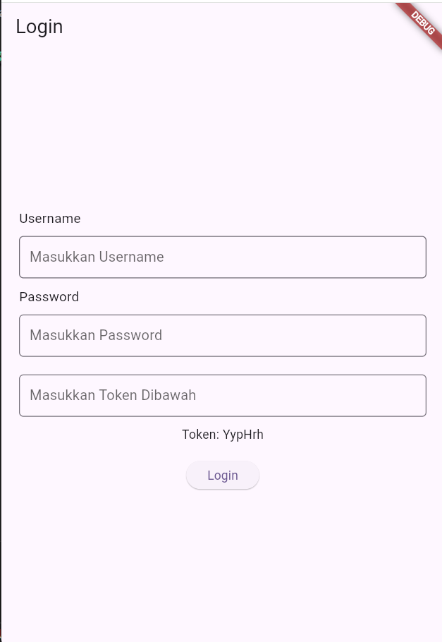
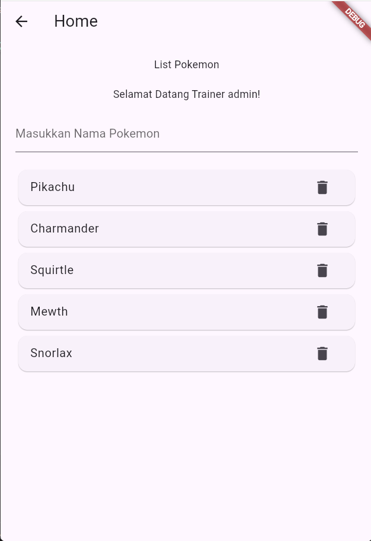

# Tugas Pertemuan 3
Nama       : Zia Khusnul Fauzi Akhmad

NIM        : H1D022023

Shift Baru : Shift D

## 1. `login.dart`
### Screenshot



**Halaman Login** untuk mengelola proses autentikasi user.

- **Source Code Penting**:
    Dalam source code ini terdapat beberapa fungsi yang penting untuk proses autentikasi user, seperti:
    - `void _saveUser()`: untuk menyimpan data user yang telah login menggunakan `SharedPreferences`.
        ```dart
        void _saveUsername() async {
            SharedPreferences prefs = await SharedPreferences.getInstance();
            prefs.setString('username', _usernameController.text);
        }
        ```
    - `void _generateToken()`: untuk mengenerate token yang akan digunakan untuk autentikasi user.
        ```dart
        void _generateToken() {
            String generateRandomString(int length) {
                const characters = 'ABCDEFGHIJKLMNOPQRSTUVWXYZabcdefghijklmnopqrstuvwxyz0123456789';
                final random = Random();
                return String.fromCharCodes(Iterable.generate(
                    length, (_) => characters.codeUnitAt(random.nextInt(characters.length))
                ));
            }

            token = generateRandomString(6);
        }
        ```
    - `void _showInput()`: untuk menampilkan textfield inputan username dan password.
        ```dart
        Widget _showInput(controller, placeholder, isPassword) {
            return Container(
                margin: const EdgeInsets.symmetric(vertical: 10.0),
                child: TextField(
                    controller: controller,
                    decoration: InputDecoration(
                        hintText: placeholder,
                        border: OutlineInputBorder(
                            borderRadius: BorderRadius.circular(5),
                        ),
                    ),
                    obscureText: isPassword,
                ),
            );
        }
        ```
    - `_showDialog()`: untuk menampilkan dialog ketika user berhasil login.
        ```dart
        void _showDialog(message, address) {
            showDialog(
                context: context,
                builder: (BuildContext context) {
                    return AlertDialog(
                        title: Text(message),
                        actions: <Widget>[
                            TextButton(
                                child: const Text('OK'),
                                onPressed: () {
                                    Navigator.push(context, MaterialPageRoute(builder: (context) => address));
                                },
                            ),
                        ],
                    );
                },
            );
        }
        ```

## 2. `Home.dart`
### Screenshot



**Home** adalah halaman utama yang dituju setelah pengguna berhasil login, dalam kasus ini adalah halaman yang menampilkan list nama pokemon yang bisa ditambah dan dihapus oleh user.

- **Source Code Penting**:
    Dalam source code ini terdapat beberapa fungsi yang penting untuk menampilkan list nama pokemon, seperti:
    - `_savePokemon()`: untuk menyimpan data pokemon yang telah ditambahkan oleh user menggunakan `SharedPreferences`.
        ```dart
        void _savePokemons() async {
            SharedPreferences prefs = await SharedPreferences.getInstance();
            prefs.setStringList('pokemons', pokemons);
        }
        ```
    - `_loadPokemons()`: untuk menampilkan data pokemon yang telah ditambahkan oleh user menggunakan `SharedPreferences`.
        ```dart
        void _loadPokemons() async {
            SharedPreferences prefs = await SharedPreferences.getInstance();
            setState(() {
                pokemons = prefs.getStringList('pokemons') ?? [];
            });
        }
        ```
    - `_loadUsername()`: untuk menampilkan data user yang telah login menggunakan `SharedPreferences`.
        ```dart
        void _loadUsername() async {
            SharedPreferences prefs = await SharedPreferences.getInstance();
            setState(() {
               username = prefs.getString('username');
            });
        }
        ```
